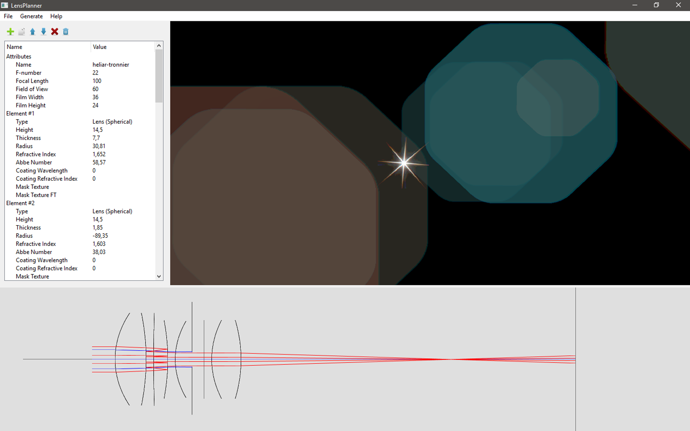
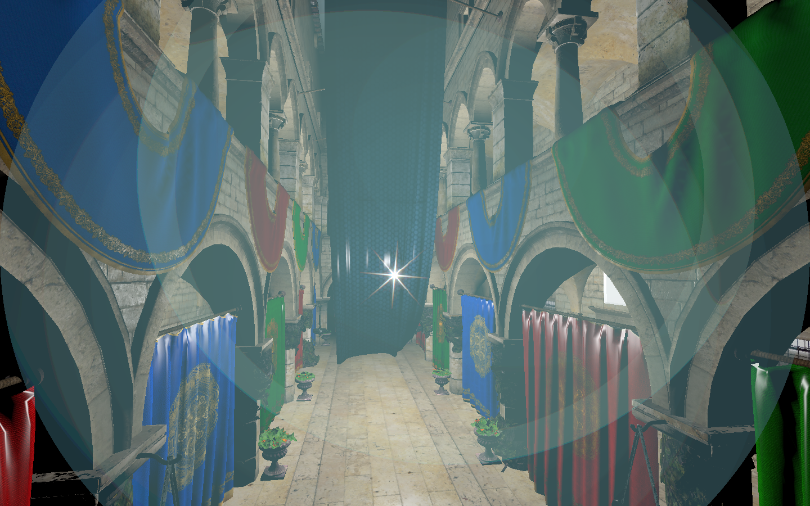

# OpenLensFlare: an Open-Source, Lens Flare Designing and Rendering Framework

Official repository for the OpenLensFlare framework.

## Building

CMake build files are provided for both the editor and runtime components.

### Required third-party libraries

- [Qt 5](https://www.qt.io/) (LensPlanner)
- [GLEW](https://glew.sourceforge.net/) (LensPlanner, runtime)
- [glm](https://glm.g-truc.net/) (LensPlanner, runtime)

## Main limitations

    - Only optical systems with one iris are supported.
    - Only ghosts that cross an aperture once can be simulated.
    - Only ghosts that are reflected twice are supported.

## Screenshots

The *LensPlanner* editor component in action.


An example simulation generated using the OpenLensFlare runtime library in an external framework.


## Related publication & citation

- [OpenLensFlare: an Open-Source, Lens Flare Designing and Rendering Framework](https://core.ac.uk/download/pdf/295592402.pdf)

If you find the framework useful, I kindly ask that you cite the paper as follows:

```
@inproceedings{coba2017openlensflare,
  author       = {Csoba, István},
  title        = {{OpenLensFlare: an Open-Source, Lens Flare Designing and Rendering Framework}},
  booktitle    = {WSCG 2017},
  booksubtitle = {Short Papers Proceedings},
  editor       = {Skala, Vaclav},
  year         = {2017},
  month        = {06},
  pages        = {195--203},
  series       = {Computer Science Research Notes},
  vol          = {2702},
  location     = {Plzeň, Czech Republic},
  organization = {Vaclav Skala--UNION Agency},
  isbn         = {978-8-086-94350-3}
}
```

## License

This project is licensed under the BSD 2-clause License, see [LICENSE](LICENSE) for more information.